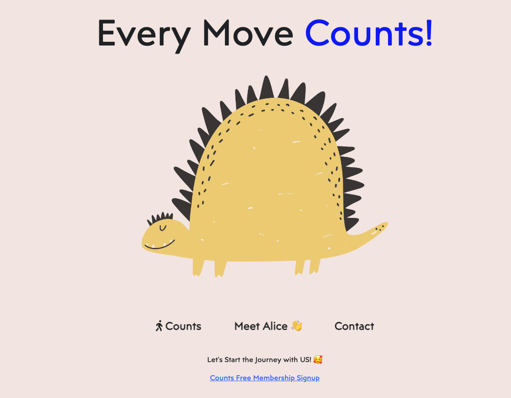

# MERN Full-stack Web Application Project - Counts 

## Counts GmbH 💖
 Daily Health Activities Tracking & Inspiration Service Platform 



[Deployment Link]()
**to be updated soon**
<br>

## Counts Initiatives 

"Every Move Counts!"

That is the motto of Counts GmbH. We welcome all kinds of movements and healthy habits, that are defined by iall different individuals. 

Counts think that the current so-called 'health trends' often do more harms than goods. For example, many people struggle with eating disorders, healthy-food obsessions or workout obsessions although they might look 'fit' or 'toned' outside. We wanted to create a place that people can become healthier in theirs own terms and pace without comparing to others by tracking their own moves and inspiration page where users get inspirted to get their body move - even if it's just 10 minutes of walk. 

## Main Functionality
0. MERN Full-stack application: Mongo DB, Express, React and Node.Js. 
1. A SPA(Single-Page-Application) frontend, built with React, consisting of multiple views and implementing all CRUD actions.
2. A REST API backend built with ExpressJS, MongoDB and Mongoose, that your React app will communicate with.
3. A REST API backend with routes that perform all CRUD actions for models.
4. 5 database models and each model represents the main functionality of the app.
5. Sign-up, log-in and log-out functionality with encrypted passwords (or social login) and authorization in a full-stack application.
6. Resolved & rejected promises and chained promises to execute asynchronous tasks in sequence and to coordinate the execution of multiple asynchronous operations. All promises have catch blocks with adequate error handling. 
7. CSS and React Bootstrap to style the application's UI and to implement a fully responsive layout.
8. Two main repositories(Frontend & Backend) to save and track changes in the source code using Git and Github
9. Agile methologies - Kanban (on Notion: check the link below)

<br>

## Getting Started

[Backend Github Link](https://github.com/virgoeun/counts-Back)


- Fork this Frontend & Backend repos
- Clone the forked repos
- Open the folder at Terminal and start:

  ```bash
  cd count-project-folder
  npm install
  npm run dev 
  (Backend: npm run server)
  ```

Since this project will hold both the client application and the server application there will be node modules in two different places. Currently, this is Frontend repository. On the localhost environments, to experience full-stack application functions, it's required to run Backend as well. 

[Backend Localhost Link](http://localhost:5005)
<br>
[Frontend Localhost Link](http://localhost:5173)


## File Structure

<details>
  <summary>Frontend: Click Here</summary>

```
src/

|-- assets/

|-- components/
|   |-- Activity/
|   |   |-- ActivityDetails.jsx
|   |   |-- AddActivity.jsx
|   |-- AdminStyle/
|   |   |-- AddAdminStyle.jsx
|   |   |-- AdminStyleList.jsx
|   |   |-- EachStyle.jsx
|   |-- AdminWorkout/
|   |   |-- AddAdminWorkout.jsx
|   |   |-- AdminWorkoutList.jsx
|   |   |-- EachWorkout.jsx
|   |-- Bookmarks/
|   |   |-- CreateBookmark.jsx
|   |   |-- EditBookmark.jsx
|   |-- Challenge/
|   |   |-- ChallengePopup.jsx
|   |   |-- ChallengePopupFunction.jsx
|   |-- ChartGroup/
|   |   |-- ChartGroup.jsx
|   |   |-- Graph.module.css
|   |-- CustomToolTip/
|   |   |-- CustomToolTip.css
|   |   |-- CustomToolTip.jsx
|   |-- CustomToolTip/
|   |   |-- CustomToolTip.css
|   |   |-- CustomToolTip.jsx
|   |-- FeedbackForm/
|   |   |-- DailyActivity.css
|   |   |-- DailyForm.jsx
|   |   |-- FormButton.jsx
|   |   |-- FormQuestions.jsx
|   |   |-- Options.jsx
|   |-- GoogleApi/
|   |   |-- Geocoder.jsx
|   |   |-- Map.jsx
|   |   |-- PlaceDetails.jsx
|   |-- ProfilePopUp/
|   |   |-- Popup.css
|   |   |-- Popup.jsx
|   |   |-- PopupFunction.jsx
|   |-- Style/
|   |   |-- GetLikedStyles.jsx
|   |   |-- LikeStyleButton.jsx
|   |-- UserWorkout/
|   |   |-- GetLikedWorkouts.jsx
|   |   |-- LikeWorkoutButton.jsx
|   |-- AdminIsAnon.jsx
|   |-- AdminIsPrivate.jsx
|   |-- HeartButton.jsx
|   |-- IsAnon.jsx
|   |-- IsPrivate.jsx
|   |-- Joke.jsx
|   |-- ProfileDetails.jsx
|   |-- ScrollToTop.jsx
|   |-- SurveyApp.jsx
|   |-- Video.jsx

|-- Context/
|   |-- auth.context.jsx

|-- pages/
|   |-- AdminAuth/
|   |   |-- AdminLoginPage.jsx
|   |   |-- AdminSignupPage.jsx
|   |-- LandingPage/
|   |   |-- Homepage.jsx
|   |   |-- Home.jsx
|   |-- YourComponent/
|   |   |-- YourComponent.js
|   |   |-- YourComponent.css
|   |-- AdminProfilePage.jsx
|   |-- AdminWorkoutPage.jsx
|   |-- AdminStylePage.jsx
|   |-- Challenge.jsx
|   |-- Chart.jsx
|   |-- Checkin.jsx
|   |-- EditCheckin.jsx
|   |-- Favorite.jsx
|   |-- LoginPage.jsx
|   |-- ProfilePage.jsx
|   |-- SignupPage.jsx
|   |-- StylesPage.jsx
|   |-- WorkoutPage.jsx

|-- static/
|   |-- questions.jsx
|-- App.css
|-- App.jsx
|-- index.css
|-- main.jsx
|-- gitignore
|-- README.md
|-- index.html
|-- package-lock.json
|-- package.json


```
</details>
<br>
<details>
  <summary>Backend: Click Here</summary>

```

|-- config/
|   |-- cloudinary.config.js
|   |-- index.js
|-- db/
|   |-- index.js
|-- error-handling/
|   |-- index.js
|-- googleMap/
|   |-- geoCoder.js
|-- middleware/
|   |-- jwt.middleware.js
|-- models/
|   |-- Activity.model.js
|   |-- Favorites.model.js
|   |-- Style.model.js
|   |-- User.model.js
|   |-- Workout.model.js
|-- public/
|   |-- images/
|   |-- scripts/
|   |   |-- index.js
|-- routes/
|   |-- Home.routes.js
|   |-- admin.routes.js
|   |-- adminStyle.routes.js
|   |-- adminWorkout.routes.js
|   |-- adminsprofile.routes.js
|   |-- auth.routes.js
|   |-- bookmarks.routes.js
|   |-- challenge.routes.js
|   |-- checkin.routes.js
|   |-- geocode.routes.js 
|   |-- index.routes.js
|   |-- joke.routes.js
|   |-- music.routes.js
|   |-- profile.routes.js
|   |-- style.routes.js
|   |-- video.routes.js
|   |-- workout.routes.js
|-- .gitignore
|-- app.js
|-- package-lock.json
|-- package.json
|-- server.js

```
</details>

## Technologies Used
- HTML
- CSS & React Bootstrap
- JavaScript
- Node.JS
- Express.Js
- React 
- Rechart
- Mongo DB & Mongoose
- Axios (external API - Spotify & GoogleMap)
- Cloudinary 
- Github 

<br>

## How To Use? (User/Admin Flow)

### User-side
1. User Signup/Login (Token-based Authnetication)
2. User re-directs to Dashboard.
3. User Add, edit, and delete daily activiy, hydration level, and sleep hours and track accoring to date ranges (CRUD implementations)
4. User track line chart of daily activiy, hydration level, and sleep hours 
5. User gets infomred about 'liked' workout programs and styles recommendation by Admin (implemented on Admin-flow below) on dashboard.
6. User checks recommended workout Programs and styles on each /workout & /style page and like each item. (Future function: Redirects to checkout page of E-commerce function)
7. User checks weekly Challenge on /challeng page, managed by Admin and check where it's happening on Google Map.


### Admin-side (More features will be updated)
1. Admin signup/login on seperate admin route.(Admin-authentication)
2. Admin redirects to Admin-only profile page.
3. Admin manages style, workout recommendation using CRUD implementation and this renders on User's style & workout pages
4. Admin gets Langtitude and Longtitude for Google Map implementation of Challenge Page. 

<br>


## Backlogs
- Style/workout Add-to-card & Payment E-commerce functions
- Admin Management functions for E-commerce for orders and deliveries
- Social Media Login
- Social Media Share & Likes
- Live Chat Functions for Customer Service
- Social Media API to connect Users to Company's social media pages

<br>

## Extra Links
- [GoogleMap API](https://developers.google.com/maps)
- [Github Backend repository Link](https://github.com/virgoeun/counts-Back)
- [Github Frontend repository Link](https://github.com/virgoeun/counts-Front)
- [Deployment Link](http://localhost:5173/)
- [Figma Link](https://www.figma.com/file/mhDzIfJH7fWj75CjbsIVcs/WD-Alice-PR3-Counts?type=design&node-id=0-1&mode=design&t=fJfTMYQChA0Q6k98-0)
- [Notion Link](https://www.notion.so/fa15f3c8153e402984647067a5ad0ff3?v=09b08a1f484043bca37284c7a032307a)
- [Slides Link](https://docs.google.com/presentation/d/1msWUCiuqnAGboJf8ruWClRLarcXbTlsZZtF64FNnTPI/edit#slide=id.g2775d7d4e5c_0_281)


